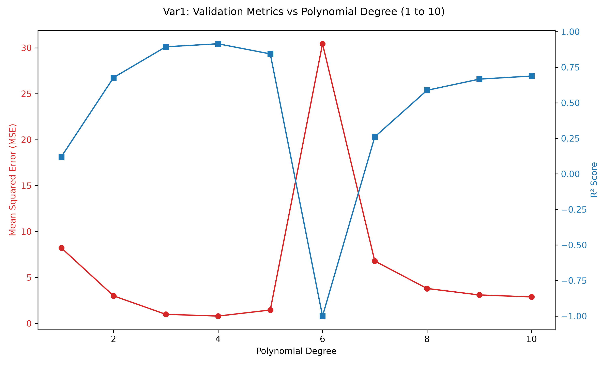
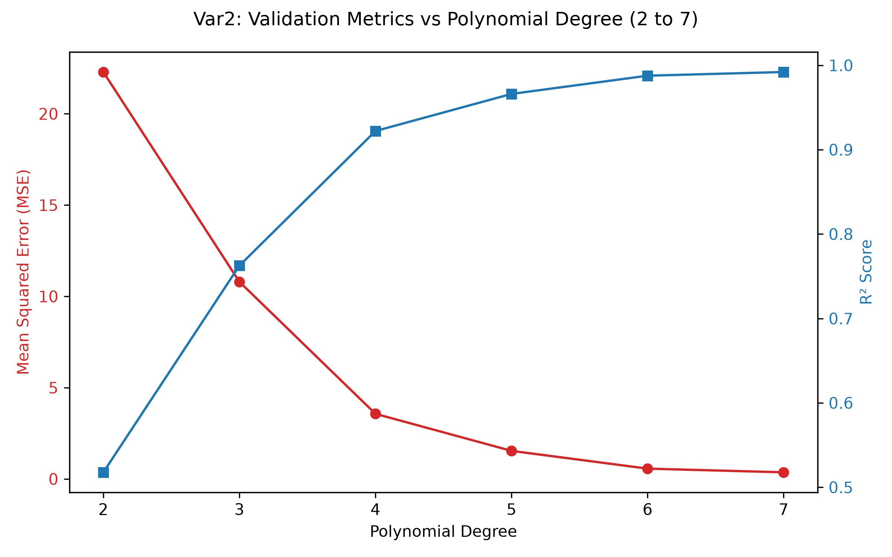

# Polynomial Regression Assignment Report

**Name:** Pragun K Kirani
**Roll Number:** BT2024176

## Introduction
In this assignment, I built polynomial regression models for two distinct phases of a multi-stage geothermal power plant expansion project. Each phase presented unique challenges and required me to build a separate model to predict the target variable `y` given a set of features. My primary objective was to obtain accurate predictions on the provided test datasets by figuring out the optimal polynomial degree and selecting the appropriate features. 

I used the provided datasets (`BT2024176_train_var1.csv` and `BT2024176_train_var2.csv`) to train my models, and I generated predictions on `BT2024176_test_var1.csv` and `BT2024176_test_var2.csv`.

## Approach and Methodology
To select the optimal polynomial degree, I took a rigorous empirical approach. I performed **5-Fold Cross-Validation** over a large range of polynomial degrees. My goal was to maximize predictive performance (R² Score) while minimizing Mean Squared Error (MSE), making sure to avoid both underfitting and overfitting.

---

## Phase 1: Power Plant Steam Turbine Optimization (var1)

### Problem Description
The first phase involves predicting the Net Power Score (`y`) based on 6 operational parameters (`x1` to `x6`) representing percentage deviations in the power plant settings. 

### Hyperparameter Tuning Results (Degrees 1 to 10)
Using all 6 features, I evaluated models from degree 1 through 10 using 5-Fold Cross-Validation.

| Degree | MSE                  | R² Score            |
|--------|----------------------|---------------------|
| 1      | 8.2186               | 0.1202              |
| 2      | 2.9925               | 0.6773              |
| 3      | 0.9841               | 0.8939              |
| 4      | 0.7940               | 0.9149              |
| 5      | 1.4540               | 0.8438              |
| 6      | 123.0929             | -12.8296            |
| 7      | 6.7832               | 0.2604              |
| 8      | 3.7966               | 0.5878              |
| 9      | 3.0945               | 0.6663              |
| 10     | 2.8772               | 0.6882              |

### Model Selection and Rationale
Based on the table and the graph, I observed the following:
1. **Underfitting at Low Degrees:** At degrees 1 and 2, my model underfit the data (R² = 0.1202 and 0.6773).
2. **Optimal Fit at Degree 4:** As the degree increased, MSE decreased and R² improved, peaking at **Degree 4** (MSE = 0.7940, R² = 0.9149).
3. **Overfitting at High Degrees:** Beyond degree 4, the validation MSE sharply increased, and the R² score dropped drastically, entering severe negative values at degree 6. This was a classic indication of the model overfitting to noise in the training set and failing to generalize. Although the metrics stabilized somewhat after degree 6, they never approached the performance of degree 4.

**Conclusion for Phase 1:** I decided the optimal model is a **Polynomial Regression model of Degree 4 using all 6 features**.

---

## Phase 2: Subterranean Thermal Reservoir Mapping (var2)

### Problem Description
The second phase requires predicting a Thermal Anomaly Score (`y`) based on 3 spatial coordinate offsets (`x1`, `x2`, `x3`). 

### Hyperparameter Tuning Results (Degrees 1 to 20)
Using all 3 spatial features, I evaluated models from degree 1 through 20 using 5-Fold Cross-Validation.

| Degree | MSE                  | R² Score            |
|--------|----------------------|---------------------|
| 1      | 34.5026              | 0.2522              |
| 2      | 22.2891              | 0.5177              |
| 3      | 10.7983              | 0.7626              |
| 4      | 3.5661               | 0.9221              |
| 5      | 1.5367               | 0.9660              |
| 6      | 0.5637               | 0.9876              |
| 7      | 0.3623               | 0.9920              |
| 8      | 0.2854               | 0.9938              |
| 9      | 0.3290               | 0.9928              |
| 10     | 0.4174               | 0.9908              |
| 11     | 0.5212               | 0.9885              |
| 12     | 1.5514               | 0.9669              |
| 13     | 21.6960              | 0.5868              |
| 14     | 2005.4662            | -36.1771            |
| 15     | 13031132933.7197     | -302784136.3581     |
| 16     | 659762111431.7620    | -11341531518.9879   |
| 17     | 68865998620.7922     | -1331147134.9910    |
| 18     | 201876030353.2496    | -4105329683.8666    |
| 19     | 192136592239.8859    | -3735532737.8618    |
| 20     | 145320422894.3460    | -2729046150.7092    |

### Model Selection and Rationale
Based on the table and the graph, I observed the following:
1. **Steady Improvement:** Unlike Phase 1, the Phase 2 data exhibited significantly higher complexity. As the polynomial degree increased from 1 to 8, the MSE continuously dropped and the R² score steadily improved.
2. **Optimal Fit at Degree 8:** My model achieved peak validation performance at **Degree 8** (MSE = 0.2854, R² = 0.9938).
3. **Catastrophic Overfitting:** Starting from degree 9, performance slowly declined until degree 13 (R² = 0.5868). At degree 14 and beyond, I observed catastrophic overfitting, with the MSE exploding into the billions and R² scores dropping to massive negative numbers. The curse of dimensionality heavily affected these extremely high-degree polynomial models.

**Conclusion for Phase 2:** I decided the optimal model is a **Polynomial Regression model of Degree 8 using all 3 features**.
